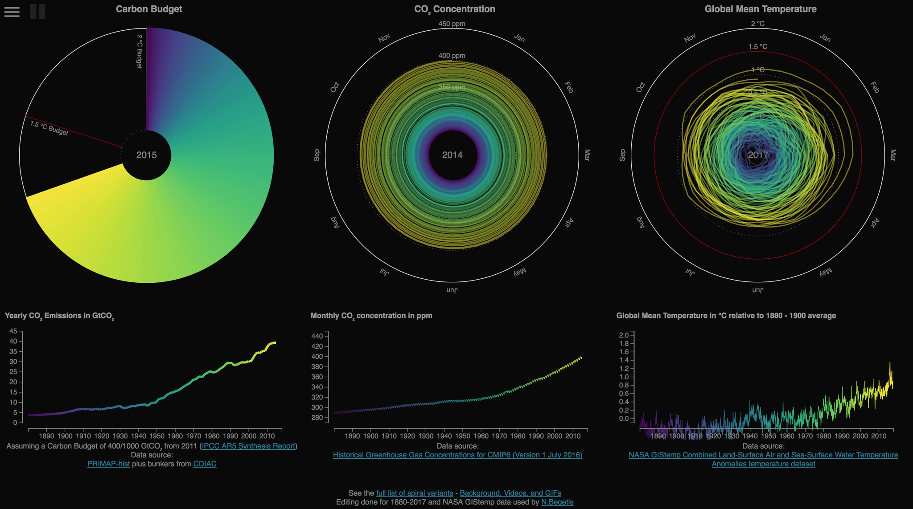

Scenario exercise for Data Scientists (Duration: 30h - weekly exercise)
==============

A webpage base on openclimatedata/climate-spirals Github repository. Written in Javascript.

[Climate spirals](https://github.com/openclimatedata/climate-spirals)

Licence: [GNU GPLv3](https://choosealicense.com/licenses/gpl-3.0/)

### Setup for Desktop (localhost) ####

##### Download latest data from GIStemp (updated once per semester)
! Remember to install wget to your computer. e.g. for MacOS: `brew install wget --with-libressl`.
  
* Current version is of August, 2017
                                                                 
```
./data/downloadGIStempData.sh
```

##### Setup and run
```
cd globalwarming
npm install
nmp run dev
```

##### Serve
After setup is ready the visualization is served in:
```
    Local: http://localhost:3000
    External: http://192.168.1.3:3000
```

and particularly the new visualization in:
* Global Mean Temperature
```
    Local: http://localhost:3000/temperature/
    External: http://192.168.1.3:3000//temperature/
```
* Carbon Budget - Global Mean Temperature
```
    Local: http://localhost:3000/carbon-budget-temperature/
    External: http://192.168.1.3:3000/carbon-budget-temperature/
```
* CO2 Concetration - Global Mean Temperature
```
    Local: http://localhost:3000/concentration-temperature/
    External: http://192.168.1.3:3000/concentration-temperature/
```
* From Emissions To Global Mean Temperature
```
    Local: http://localhost:3000/from-emissions-to-global-warming/
    External: http://192.168.1.3:3000/from-emissions-to-global-warming/
```
* Temperature Spiral
```
    Local: http://localhost:3000/temperature-line-chart/
    External: http://192.168.1.3:3000/temperature-line-chart/
```
* Carbon Budget - Global Mean Temperature
```
    Local: http://localhost:3000/carbon-budget-temperature-line-chart/
    External: http://192.168.1.3:3000/carbon-budget-temperature-line-chart/
```
* CO2 Concetration - Global Mean Temperature
```
    Local: http://localhost:3000/concentration-temperature-line-chart/
    External: http://192.168.1.3:3000/concentration-temperature-line-chart/
```
* From Emissions To Global Mean Temperature
```
    Local: http://localhost:3000/from-emissions-to-global-warming-line-chart/
    External: http://192.168.1.3:3000/from-emissions-to-global-warming-line-chart/
```
* Temperature Spiral
```
    Local: http://localhost:3000/temperature-line-chart/
    External: http://192.168.1.3:3000/temperature-line-chart/
```


### What's included ###
#### Visualizations ####
* Climate Spiral Loops 
* Global, Northern and Southern Concetrations
* Carbon Bubget
* Concentration Spiral
* Temperature Spiral `changed by the @author`
* Budget and Temperature `changed by the @author`
* Concentration and Temperature `changed by the @author`
* Climate Spiral Loops
* Budget and Concetration
* From Emissions to Global Warming `changed by the @author`
* more... `to be added by the @author`

#### Scenario Task #### 
Please use any dataset provided at [https://data.giss.nasa.gov/gistemp/](https://data.giss.nasa.gov/gistemp/) to visualize, in an effective way, global warming.
Also, write documentation to present the code used in steps (data reading, data cleansing/manipulation, data visualization) and elaborate why your end result visualizes the data in an effective way. In the documentation you can include the restrictions, decisions taken and possible future work that could be done on this exercise.

Technical details:
- Solution should be written in your favourite language/toolset (e.g python, R, etc).
- Deliverable should be a zip containing the sources/assets of the solution together with the documentation and command(s) to build it.
- Deliverable should be sent as a publicly available URL (e.g dropbox link, google drive link, etc).


#### Steps and Methodology #### 
1. We got the datasets found in the `data` directory from the provided url at [https://data.giss.nasa.gov/gistemp/](https://data.giss.nasa.gov/gistemp/) 
2. We decided proper solutions for visualizing effectively the data provided. In this task we decided to visualize them using the d3js Javascript library by using open-source examples from github. You can find more in helpful links section.
3. We found how the NASA's GIStemp data should be transformed and cleansed to be given as an input to the d3 visualizations
    * The GIStemp data are represented as:
    ```
    Year,Jan,Feb,Mar,Apr,May,Jun,Jul,Aug,Sep,Oct,Nov,Dec,J-D,D-N,DJF,MAM,JJA,SON
    1880,-.81,-.39,-.46,-.65,-.34,-.47,-.46,.09,-.49,-.66,-.50,-.53,-.47,\*\*\*,\*\*\*,-.48,-.28,-.55
    1881,-.77,-.61,-.35,-.24,-.01,-1.08,-.50,-.22,-.33,-.47,-.54,-.13,-.44,-.47,-.64,-.20,-.60,-.45
    ...

    ```
    * The data given as input to the d3js should be like:
    ```year,month,value
       1850,1,-.3878284313725491
       1850,2,0.033171568627450965
       1850,3,-.417828431372549
       1850,4,-.25482843137254896
       1850,5,-.01182843137254902
       1850,6,0.102171568627451
       1850,7,0.186171568627451
       1850,8,0.08217156862745101
       1850,9,-.120828431372549
       1850,10,-.13782843137254902
       1850,11,0.12517156862745102
       1850,12,0.04717156862745098
       1851,1,0.015171568627451004
       1851,2,-.04382843137254899
       1851,3,-.16782843137254905
       ...
    ```
4. We created an R script(read, manipulate/cleanse, trasform, export) that does this job as and is provided in the directory `rscript`
5. We also backed up the previous data files used and transformed the emissions.csv and concentrations csv files to start from 1880 instead of 1850 to be simultaneous with our new data on visualizations.

### Screenshots ###



## Future work ##
1. `TODO` More visualization can be produced using the rest of the data like the seasonal data. An idea on that is to calculate the range of temperature anomaly by season (or by month) and infer if there is an exact season that the temperature difference has been amplified due to the global warming and the ice melting.
2. `TODO` A comparison between data gathered from Air and Sea surface with those gathered from meteorological stations.
3. `TODO` To visualize different data now you have to switch public/temperatures.csv file content manually. Later it will be automated


### Helpful Links ###

1. [Visualizing Global Warming through Shiny](https://nycdatascience.com/blog/student-works/visualizing-global-warming-through-shiny/) - 1st visualization idea for future work. Showing also how to retrieve, parse  and clean data.
2. [Streamgraph Visualization of global warming using d3js](https://paolotoffanin.wordpress.com/2016/10/04/streamgraph-visualization-of-global-warming/) - 2nd visualization idea and example code
3. [Creating a Climate Change Visualization using D3.js](https://pstblog.com/2016/10/26/climate-change) - 3rd visualization idea using d3js
4. [Climate Lab Book](http://www.climate-lab-book.ac.uk/visualisation-resources/) - Set of climate change visualizations
5. [What's Really Warming the World (Article)](https://www.bloomberg.com/graphics/2015-whats-warming-the-world/) - interesting article and results found
6. [Heart-Wrenching Video Shows Starving Polar Bear on Iceless Land](https://news.nationalgeographic.com/2017/12/polar-bear-starving-arctic-sea-ice-melt-climate-change-spd/) - Heart-Wrenching Video Shows Starving Polar Bear on Iceless Land
7. [Gallery of d3 visualizations](https://github.com/d3/d3/wiki/Gallery) - d3 wiki gallery for visualization


## Readme as in forked git repository openclimatedata/climate-spirals ##

D3-based take on the Climate Spiral by [Ed Hawkins](https://twitter.com/ed_hawkins)
<http://www.climate-lab-book.ac.uk/spirals/>

Extended with Carbon Budget and Concentration Spiral by

[Robert Gieseke](https://www.pik-potsdam.de/members/gieseke)
and [Malte Meinshausen](https://twitter.com/meinshausen)

[PRIMAP group](https://www.pik-potsdam.de/research/climate-impacts-and-vulnerabilities/research/rd2-flagship-projects/primap/primap),
[Potsdam Institute for Climate Impact Research, Germany](https://pik-potsdam.de) &
[Australian-German Climate & Energy College, The University of Melbourne, Australia](http://www.climate-energy-college.net/)

Based on GPL-licensed D3 example code by Mike Bostock.
